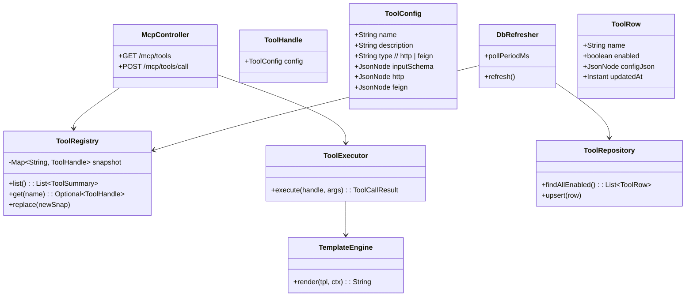
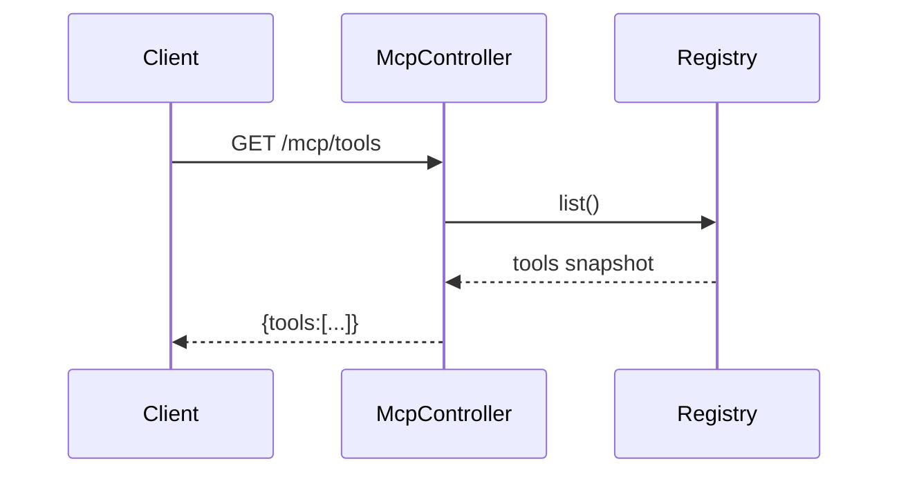
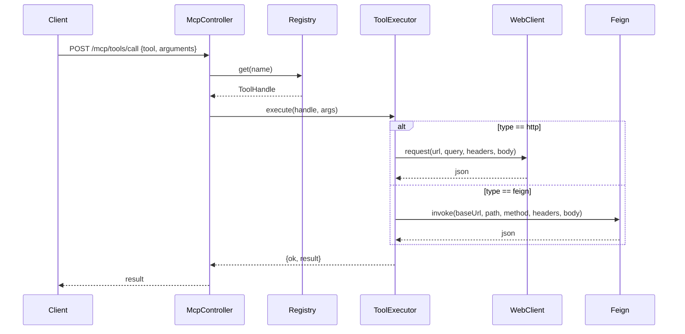
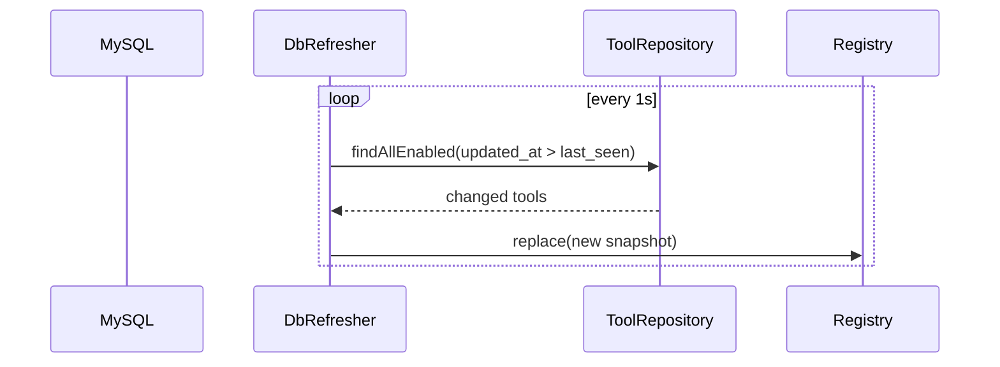
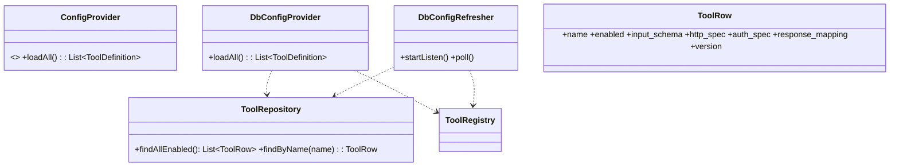
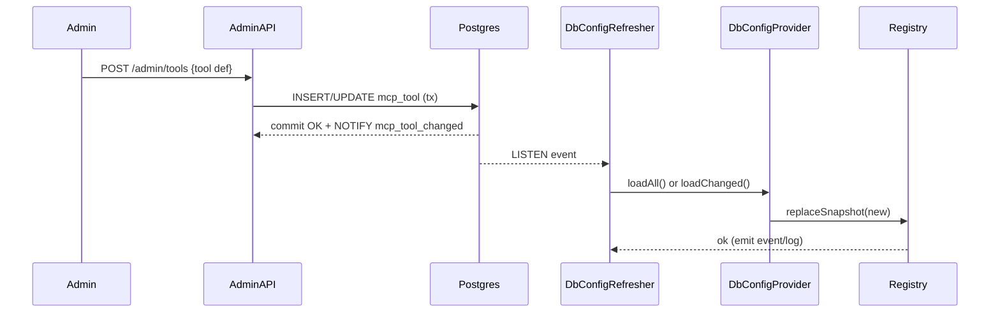
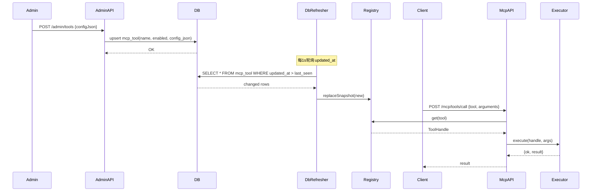

# MCP Server 最简核心设计方案

## 1. 核心功能
1. 支持 MCP Server（tools/list 和 tools/call 接口）
2. 支持动态注册接口到 MCP Server
3. 动态注册的接口信息保存到 MySQL 数据库
4. 动态注册的接口使用 JSON 配置
5. 动态接口类型支持 HTTP 和 Spring Feign 两种

## 2. 技术栈
- Spring Boot 3.x + WebFlux
- MySQL 数据库（127.0.0.1:3307, username: vanna, password: vanpass）
- OpenFeign（Feign 客户端）
- Jackson（JSON 处理）
- Maven 构建

---

## 3. 架构图（最小化）
```mermaid
flowchart LR
  C[Client (curl)] --> A[MCP API\n(/mcp/tools, /mcp/tools/call)]

  subgraph Server
    A --> R[ToolRegistry (Snapshot)]
    A --> E[ToolExecutor]
    E --> H[HTTP Client (WebClient)]
    E --> F[OpenFeign (runtime)]
    D[DbRefresher (poll 1s)] --> R
  end

  DB[(MySQL: mcp_tool)]
  DB --> D
```

说明：
- 使用快照替换，轮询 MySQL 的更新时间实现“动态注册 -> 立即生效（~1s）”。
- 仅支持 HTTP 与 Feign 两种调用路径，返回结果直接透传。

---

## 4. 内部组件图（核心版）


---

## 5. 组件交互图（时序）
1) 列出工具


2) 调用工具


3) DB 动态刷新（轮询）


---

## 6. API 设计（curl 可测）
- GET /mcp/tools
  - 响应：{ tools: [ { name, description, inputSchema } ] }
  - curl 示例：
    curl -s http://localhost:8080/mcp/tools | jq

- POST /mcp/tools/call
  - 请求：{ tool: string, arguments: object }
  - 响应：{ ok: boolean, result?: any, error?: { code, message } }
  - curl 示例：
    curl -s -X POST http://localhost:8080/mcp/tools/call \
      -H 'Content-Type: application/json' \
      -d '{"tool":"weather.search","arguments":{"city":"Shanghai"}}' | jq

- POST /admin/tools（动态注册/更新）
  - 请求：
    {
      "name": "weather.search",
      "enabled": true,
      "configJson": { ... 见 7. 配置规范 }
    }
  - 响应：{ ok: true }
  - curl 示例：
    curl -s -X POST http://localhost:8080/admin/tools \
      -H 'Content-Type: application/json' \
      -d @weather.search.json | jq

- 可选：DELETE /admin/tools/{name}

---

## 7. 配置规范（JSON）
- 同一个 JSON 内包含完整工具定义：name, description, type(http|feign), inputSchema(可选), 以及对应类型细节。

- HTTP：
{
  "name": "weather.search",
  "description": "查询天气",
  "type": "http",
  "inputSchema": {
    "type": "object",
    "required": ["city"],
    "properties": { "city": { "type": "string" } }
  },
  "http": {
    "method": "GET",
    "url": "https://api.example.com/weather",
    "query": { "q": "{{args.city}}" },
    "headers": { "Authorization": "Bearer {{secrets.WEATHER_API_TOKEN}}" },
    "timeoutMs": 3000
  }
}

- Feign：
{
  "name": "user.get",
  "description": "查询用户",
  "type": "feign",
  "inputSchema": { "type": "object", "required": ["id"], "properties": {"id": {"type": "string"}} },
  "feign": {
    "baseUrl": "https://api.example.com",
    "path": "/users/{id}",
    "method": "GET",
    "headers": { "X-Req": "{{args.id}}" },
    "timeoutMs": 3000
  }
}

说明：
- 模板变量：{{args.xxx}} 取调用入参；{{secrets.KEY}} 取环境变量。

---

## 8. 数据模型（MySQL）
- 连接：127.0.0.1:3307，username: vanna，password: vanpass
- 建表：
CREATE TABLE IF NOT EXISTS mcp_tool (
  id BIGINT PRIMARY KEY AUTO_INCREMENT,
  name VARCHAR(200) UNIQUE NOT NULL,
  enabled TINYINT(1) NOT NULL DEFAULT 1,
  config_json JSON NOT NULL,
  updated_at TIMESTAMP NOT NULL DEFAULT CURRENT_TIMESTAMP ON UPDATE CURRENT_TIMESTAMP
);
CREATE INDEX idx_mcp_tool_updated_at ON mcp_tool(updated_at);

---

## 9. 刷新与快照
- DbRefresher 每 1s 轮询：SELECT * FROM mcp_tool WHERE updated_at > last_seen
- 将结果转换为 ToolConfig 列表 -> 构建不可变 Map<String, ToolHandle> -> 原子替换 Registry 快照
- 失败保留旧快照；日志告知

---

## 10. 执行逻辑（HTTP/Feign）
- HTTP：用 WebClient 依配置组装 URL、query、headers、body（GET/POST），timeoutMs 生效；响应 JSON 直接作为 result
- Feign：运行时用 Feign.builder() 创建客户端（或根据 baseUrl 缓存），按 method/path/headers 调用；响应 JSON 透传
- 参数校验：若 inputSchema 存在，仅做 required 字段存在性检查（最小实现）

---

## 11. 依赖与启动
- 依赖：spring-boot-starter-webflux, spring-boot-starter-jdbc 或 data-jpa, feign-core, jackson-databind, mysql-connector-j
- application.yml：配置 MySQL 连接（127.0.0.1:3307 vanna/vanpass）与刷新间隔（1s）
- 启动后用 curl 按第 6 节示例测试

---

## 12. 开发顺序（最小）
1) 数据表与 Repository
2) ToolConfig 模型与 Registry 快照
3) DbRefresher 轮询更新
4) McpController: GET /mcp/tools, POST /mcp/tools/call
5) AdminController: POST /admin/tools
6) ToolExecutor: http 与 feign 两条路径

---

这是一份聚焦最核心需求的精简设计。确认后我可以按此生成最小代码骨架与 README（含 curl 测试命令）。


### 19. 数据库存储的配置与动态刷新（DB-backed Config）
- 目标：将工具配置从文件迁移到数据库，支持用户通过管理端写入/修改配置，MCP Server 监听数据库变更并动态刷新，做到“秒级生效、零停机”。
- 策略：抽象 ConfigProvider SPI，FileConfigProvider（YAML）与 DbConfigProvider（DB）可并存，运行时选择或同时启用（DB 优先）。

#### 19.1 数据模型与表结构（以 Postgres 为例）
- 设计要点：将嵌套字段以 JSONB 存储，减少表拆分与联表；仅保存“密钥引用”，不落盘明文密钥。
- 建议表：
```sql
-- 工具定义（核心快照来源）
CREATE TABLE IF NOT EXISTS mcp_tool (
  id BIGSERIAL PRIMARY KEY,
  name TEXT UNIQUE NOT NULL,
  description TEXT,
  enabled BOOLEAN NOT NULL DEFAULT TRUE,
  input_schema JSONB NOT NULL,
  transport TEXT NOT NULL CHECK (transport IN ('http', 'grpc', 'graphql')),
  http_spec JSONB,           -- { method, url, headers, queryTpl, bodyTpl, timeoutMs, retry, circuitBreaker, rateLimit }
  auth_spec JSONB,           -- { type: 'none'|'apiKey'|'oauth2', config: {...} }
  response_mapping JSONB,    -- { type: 'jsonPath'|'template'|'passthrough', ... }
  policy JSONB,              -- 可选：通用策略归一处
  tenant_id TEXT,            -- 可选：多租户
  version BIGINT NOT NULL DEFAULT 0, -- 逻辑版本（每次更新+1）
  updated_at TIMESTAMPTZ NOT NULL DEFAULT NOW(),
  updated_by TEXT
);

-- 全局版本（可选：单行），或改为监听 NOTIFY
CREATE TABLE IF NOT EXISTS mcp_config_version (
  id SMALLINT PRIMARY KEY DEFAULT 1,
  version BIGINT NOT NULL
);
```
- 变更触发（Postgres）：
```sql
-- 写入时 bump version 并 NOTIFY（服务端 LISTEN 接收）
CREATE OR REPLACE FUNCTION mcp_tool_notify() RETURNS trigger AS $$
BEGIN
  NEW.version := COALESCE(OLD.version, 0) + 1;
  NEW.updated_at := NOW();
  PERFORM pg_notify('mcp_tool_changed', NEW.name);
  RETURN NEW;
END; $$ LANGUAGE plpgsql;

DROP TRIGGER IF EXISTS trg_mcp_tool_notify ON mcp_tool;
CREATE TRIGGER trg_mcp_tool_notify
BEFORE INSERT OR UPDATE OR DELETE ON mcp_tool
FOR EACH ROW EXECUTE FUNCTION mcp_tool_notify();
```

#### 19.2 配置加载与快照构建（DbConfigProvider）
- 启动：加载 enabled=true 的所有工具，组装为 ToolDefinition 列表，构建不可变快照替换 Registry。
- 增量刷新：
  - 模式A（LISTEN/NOTIFY）：长连接监听 mcp_tool_changed，一旦收到事件即读取受影响的工具（或全量 diff）。
  - 模式B（轮询）：每 1~2s 读取 SELECT MAX(version) 或 MAX(updated_at) 对比本地快照版本，若提升则增量查询变更行。
- 并发一致性：同 YAML 模式，采用快照替换；失败则保留旧快照并记录错误。

#### 19.3 管理面写入与安全
- 管理 API（可选）：POST/PUT /admin/tools -> 校验 -> 事务写表 -> 自动触发 NOTIFY。
- 审计：记录 updated_by、变更 diff（可另建 mcp_tool_audit）。
- 密钥：仅保存 ${secrets.KEY} 引用；真实密钥由 SecretResolver 注入。

#### 19.4 读写路径与组件（DB 版）
```mermaid
flowchart LR
  subgraph Admin[Admin Plane]
    UI[Admin UI]
    APIS[Admin API]
  end
  subgraph DB[(Postgres)]
    TBL[mcp_tool]
    VER[mcp_config_version]
  end
  subgraph Server[MCP Server]
    A[MCP API Adapter]
    R[ToolRegistry\n(Immutable Snapshot)]
    RP[ToolRepository]
    D[DbConfigRefresher\n(LISTEN/Poll)]
    E[ToolExecutor]
  end
  UI --> APIS --> DB
  DB -- NOTIFY/LISTEN --> D --> RP --> R
  A --> R
  A --> E
```

#### 19.5 内部组件图（DB 扩展）


#### 19.6 组件交互（时序：管理员新增/更新工具）


#### 19.7 迁移与回退
- 迁移：提供一次性导入器（YAML -> DB），或在启动期读取 YAML 并同步到 DB。
- 回退：保留最近 N 个快照（内存/持久化），当新配置装载失败时自动回退至上一个稳定版本。

#### 19.8 多实例与一致性
- 多副本部署：每个实例都 LISTEN 同一通道或轮询版本；事件到达即各自刷新，最终一致。
- 顺序性：使用 version 单调递增，刷新时丢弃过期版本；必要时引入“刷新进行中”互斥避免抖动。

#### 19.9 性能与可靠性
- 批量装载：工具数量大时分页加载并并行预编译模板/Schema。
- 限流保护：当频繁变更时对刷新加去抖/合并窗口（如 300ms）。
- 观测：暴露 refresh_count、last_refresh_version、last_refresh_latency、refresh_failures 指标。

备注：若使用 MySQL 等不支持原生 LISTEN/NOTIFY，可用轮询方案或引入 CDC（Debezium -> Kafka）作为事件源。

### 20. 最简核心版（Lite）——仅保留你要求的功能

本章节在不引入复杂治理与高级特性的前提下，聚焦 5 项最小能力：
1) 支持 MCP Server
2) 支持动态注册接口到 MCP Server
3) 动态注册的接口信息保存到数据库
4) 动态注册的接口使用 JSON 配置
5) 动态接口类型仅支持 HTTP 与 Spring Feign 两种

#### 20.1 架构概览（Lite）
```mermaid
flowchart LR
  C[Client] --> A[MCP API\n(/mcp/tools, /mcp/tools/call)]
  subgraph Server
    A --> R[ToolRegistry (Snapshot)]
    A --> E[ToolExecutor]
    E --> H[HTTP Client (WebClient)]
    E --> F[Feign Client (Programmatic)]
    D[DbRefresher (poll 1s)] --> R
  end
  subgraph Admin
    UI[Admin UI/Postman]
    ADM[Admin API\n(/admin/tools)]
  end
  DB[(DB: mcp_tool)]
  UI --> ADM --> DB
  DB --> D
```

- 只保留一个轻量的 DbRefresher（默认 1s 轮询 DB 的 updated_at/version），刷新到 Registry 快照。
- 无熔断/限流/观测等扩展；错误直接转为简单错误码与消息。

#### 20.2 数据库与最小数据模型
- 单表（Postgres/MySQL 皆可；示例以 Postgres）：
```sql
CREATE TABLE IF NOT EXISTS mcp_tool (
  id BIGSERIAL PRIMARY KEY,
  name TEXT UNIQUE NOT NULL,
  enabled BOOLEAN NOT NULL DEFAULT TRUE,
  config_json JSONB NOT NULL,   -- 完整工具配置（见 20.3）
  updated_at TIMESTAMPTZ NOT NULL DEFAULT NOW()
);
CREATE INDEX IF NOT EXISTS idx_mcp_tool_updated_at ON mcp_tool(updated_at);
```
- 运行时仅使用 name、enabled 与 config_json；无额外拆分。

#### 20.3 工具配置 JSON（最小规范）
- 通用字段：
  - name: 工具名（唯一）
  - description: 描述（可选）
  - type: "http" | "feign"
  - inputSchema: 可选；若不提供，仅做必填参数存在性校验

- HTTP 类型示例：
```json
{
  "name": "weather.search",
  "description": "查询天气",
  "type": "http",
  "inputSchema": {
    "type": "object",
    "required": ["city"],
    "properties": { "city": { "type": "string" } }
  },
  "http": {
    "method": "GET",
    "url": "https://api.example.com/weather",
    "query": { "q": "{{args.city}}" },
    "headers": { "Authorization": "Bearer {{secrets.WEATHER_API_TOKEN}}" },
    "timeoutMs": 3000
  }
}
```

- Feign 类型示例（最小）：
```json
{
  "name": "user.get",
  "description": "查询用户",
  "type": "feign",
  "inputSchema": { "type": "object", "required": ["id"], "properties": {"id": {"type": "string"}} },
  "feign": {
    "baseUrl": "https://api.example.com",
    "path": "/users/{id}",
    "method": "GET",
    "headers": { "X-Req": "{{args.id}}" },
    "timeoutMs": 3000
  }
}
```
- 模板占位：
  - args.xxx 代表调用入参
  - secrets.KEY 代表环境变量或外部密钥（最小版直接从 env 读取）

#### 20.4 API（仅 3 个端点）
- MCP
  - GET /mcp/tools -> { tools: [{ name, description, inputSchema }] }
  - POST /mcp/tools/call -> { tool, arguments } => { ok, result | error }
- Admin（最小）
  - POST /admin/tools  创建或更新一个工具定义
    - Body: { name, enabled, configJson } 或直接传工具 JSON，服务端封装入表
  - 可选：DELETE /admin/tools/{name} 下线工具

保存成功后，DbRefresher 在 1 秒内轮询到 updated_at 变化，替换 Registry 快照，立刻生效。

#### 20.5 执行逻辑（简化）
- 取快照：Registry.get(tool) -> ToolHandle
- 校验参数：若有 inputSchema，则做必填校验（可后续接入完整 JSON Schema）
- 类型分发：
  - type=http：使用 WebClient 组装 URL（含 query）、headers、body；支持 GET/POST；timeoutMs 生效
  - type=feign：使用 OpenFeign Feign.builder() 运行时创建 Client（或复用缓存），按 baseUrl+path 与 method 调用；支持 headers 注入与 simple body
- 模板渲染：用一个极简模板引擎（如 Mustache 或自研简单占位替换）渲染 headers/query/path/body
- 返回：上游 JSON 直接透传为 result；异常返回 { ok:false, error:{ code, message } }

#### 20.6 依赖与项目骨架（最小）
- 依赖：
  - spring-boot-starter-webflux（或 webmvc 均可；WebFlux 对 HTTP 客户端更简洁）
  - spring-boot-starter-validation（可选）
  - spring-boot-starter-data-jdbc 或 data-jpa（二选一）
  - io.github.openfeign:feign-core（必需），可选 feign-okhttp 提升 HTTP 能力
  - jackson-databind
- 目录：
  - adapter/mcp: McpController
  - adapter/admin: AdminController（最小）
  - core/registry: ToolRegistry, ToolHandle
  - core/executor: ToolExecutor, TemplateEngine
  - core/config: DbRefresher, ToolConverter
  - infra/db: ToolRepository

#### 20.7 时序（动态注册与调用）


#### 20.8 简化约束
- 仅支持 HTTP/Feign 两类；方法先支持 GET/POST；复杂鉴权和治理暂不内置。
- 入参校验最小化；可按需启用完整 JSON Schema 校验。
- 刷新采用轮询，避免数据库特性依赖；如需秒级更快可调低间隔或后续接入事件通知。

以上即“最小可用”的核心方案，满足你列出的 5 点需求，其它复杂能力均暂不引入。需要的话，我可以据此直接生成一个精简代码骨架并提供运行说明。

## 附录A：configJson 支持 http/feign 类型与 Admin 请求格式（补充）
- configJson 通过字段 type 指定类型："http" 或 "feign"；对应在 http 或 feign 节点下配置细节。
- Admin 动态注册接口时，请求体为：{ name, enabled, configJson }，其中 configJson 即完整工具配置 JSON。

示例（HTTP）：
{
  "name": "weather.search",
  "description": "查询天气（echo 测试）",
  "type": "http",
  "inputSchema": {"type": "object", "required": ["city"], "properties": {"city": {"type": "string"}}},
  "http": {
    "method": "GET",
    "url": "https://postman-echo.com/get",
    "query": { "q": "{{args.city}}" },
    "headers": { "X-Demo": "mcp-lite" },
    "timeoutMs": 3000
  }
}

示例（Feign）：
{
  "name": "user.get",
  "description": "查询用户",
  "type": "feign",
  "inputSchema": {"type": "object", "required": ["id"], "properties": {"id": {"type": "string"}}},
  "feign": {
    "baseUrl": "https://api.example.com",
    "path": "/users/{{args.id}}",
    "method": "GET",
    "headers": { "X-Req": "{{args.id}}" },
    "timeoutMs": 3000
  }
}

外层 Admin upsert 请求体示例：
{
  "name": "weather.search",
  "enabled": true,
  "configJson": { /* 上述任一 configJson */ }
}

## 附录B：ToolRepository 读写说明（补充）
- 表：mcp_tool(name UNIQUE, enabled, config_json JSON, updated_at TIMESTAMP)
- 行为：
  - findAllEnabled() -> 读取所有 enabled=1 的工具
  - findChangedSince(Instant since) -> 增量检测 updated_at > since 的变更
  - upsert(name, enabled, configJson) -> 先 UPDATE，不存在则 INSERT
- DbRefresher 每 1s 调用 findChangedSince()，如有变更则重建快照：
  - 读取 findAllEnabled() 全量 -> 映射为 ToolConfig -> registry.replace(newSnap)
- 代码关键位置参考：src/main/java/com/example/mcp/infra/db/ToolRepository.java 与 src/main/java/com/example/mcp/core/config/DbRefresher.java


## 附录C：MCP WebSocket + JSON-RPC 适配（新增）
- 端点：ws://<host>:<port>/mcp/ws（Spring WebFlux WebSocket）
- 协议：JSON-RPC 2.0
- 支持方法：
  - initialize
  - tools/list
  - tools/call
- 关键实现：
  - McpWebSocketHandler：解析 JSON-RPC 请求，路由到工具注册表/执行器，非阻塞返回
  - WebSocketConfig：注册 /mcp/ws 映射

请求/响应示例：
- initialize
  请求：
  {"jsonrpc":"2.0","id":1,"method":"initialize","params":{}}
  响应：
  {"jsonrpc":"2.0","id":1,"result":{"serverInfo":{"name":"mcp-lite-java","version":"0.1.0"},"capabilities":{"tools":true}}}

- tools/list
  请求：
  {"jsonrpc":"2.0","id":2,"method":"tools/list","params":{}}
  响应：
  {"jsonrpc":"2.0","id":2,"result":{"tools":[{"name":"weather.search","description":"...","inputSchema":{...}}]}}

- tools/call
  请求：
  {"jsonrpc":"2.0","id":3,"method":"tools/call","params":{"tool":"weather.search","arguments":{"city":"Shanghai"}}}
  响应（成功）：
  {"jsonrpc":"2.0","id":3,"result":{"content":{ /* 外部 HTTP 返回 JSON */ }}}
  响应（失败）：
  {"jsonrpc":"2.0","id":3,"error":{"code":-32000,"message":"<错误信息>"}}

错误码约定：
- -32700 Parse error；-32601 Method not found；-32603 Internal error
- -32000…-32099 用于工具调用等服务端自定义错误

## 附录D：动态下线立即生效（新增）
- Admin 接口：
  - POST /admin/tools：写库后调用 refreshNow()，注册表快照立即更新
  - DELETE /admin/tools/{name}：enabled=false 后调用 refreshNow()，下线即时生效
- DbRefresher.refreshNow()：强制重建快照（跳过增量条件判断）

## 附录E：推荐测试流程（调整）
1) 先查询 tools/list（应为空或无目标工具）
2) 动态注册（POST /admin/tools）
3) 再查 tools/list（应出现新工具）
4) 调用 tools/call（应 ok=true 并返回外部响应）
5) 下线（DELETE /admin/tools/{name}）
6) 立即再查 tools/list（应反映最新快照；执行将返回 NOT_FOUND 或不可调用）
7) 重新上线（POST /admin/tools，enabled=true）
8) 再查 tools/list

注：等价的 WebSocket JSON-RPC 测试可用 /mcp/ws 端点，方法与请求体如上示例。
